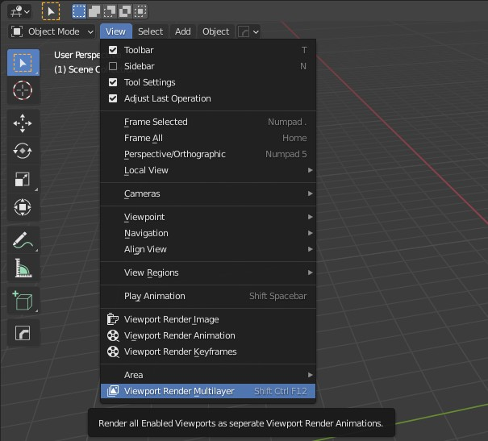

# Introduction

Simple Add-on to render all your view layers as a viewport render animation. 

Add a view layer, setup the output folder and file output settings. 

Now click <b>Viewport Render Multilayer</b> in the View Menu of the 3D Viewport.
  

  
Only the View Layers, enabled for rendering will be renderd. Choose a small frame range to test it first because blender will freeze while the process is running. 

Open a console before starting to see updates.
  

# Features

- auto-generate folder structure for output, named by the view layers

- render preview within minutes instead of hours

- use blender's video sequence editor to composite your rendered layers

- composite multiple layer togehter

- enhance visual quality by using Eevee's Ambient Occlusion, Screen Space Reflection or Motion Blur

- disable overlay to get rid off all the lines and empties
   

     

